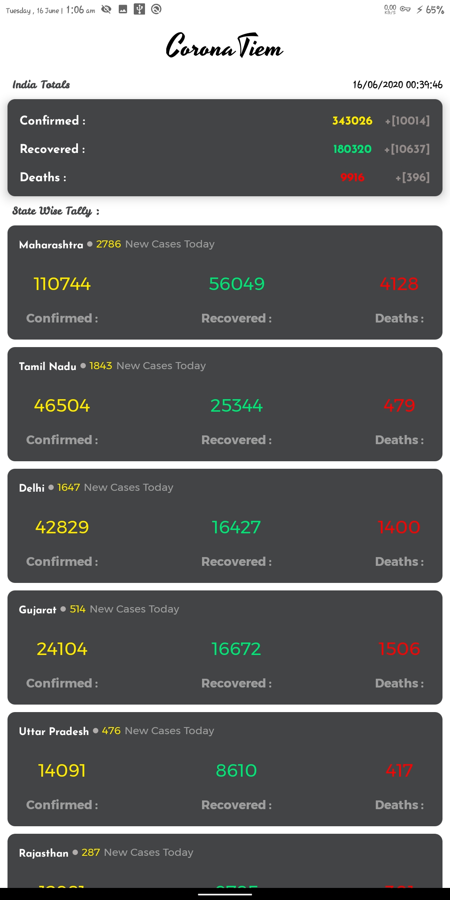
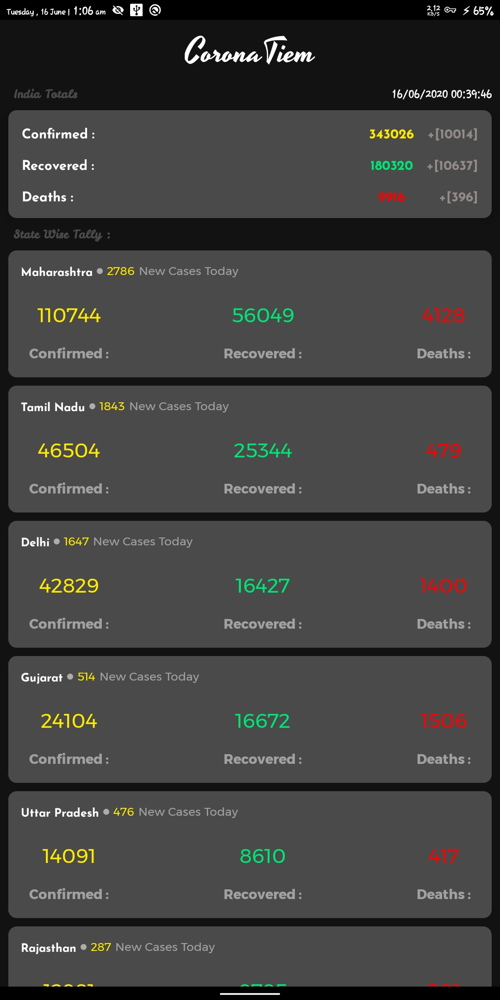

# CoronaTiem   

CoronaTiem is an App for Tracking Corona Virus Cases in India.The data is provided by https://www.covid19india.org

  - Offline Caching of Data using Room
  - Dependency Injection with Kodein-DI
  - Use of MVVM Pattern
  - Use of Groupie for recycler View
  - Use of DataBinding (with Groupie)
  - Dark Mode Support
 
  

 #### Feel Free to make a PR or Issue
 
 
 #### Star the Repo if you find it useful 

  

 ##### Peace Out

